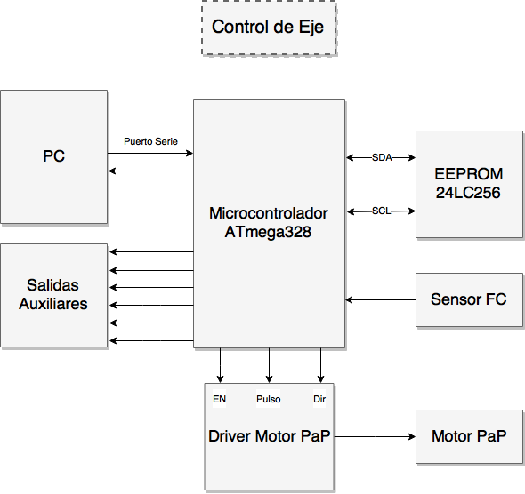
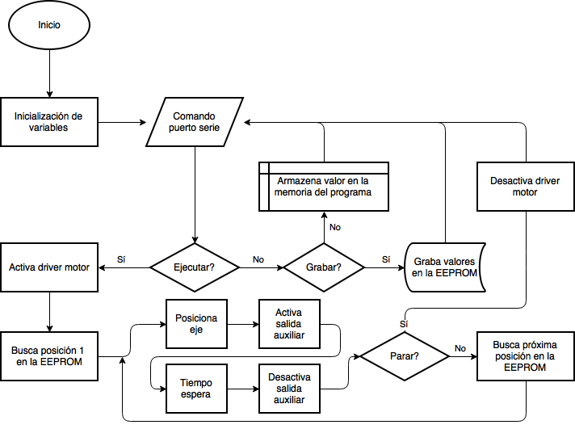
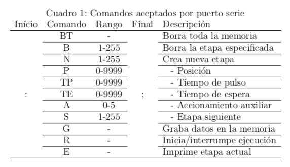
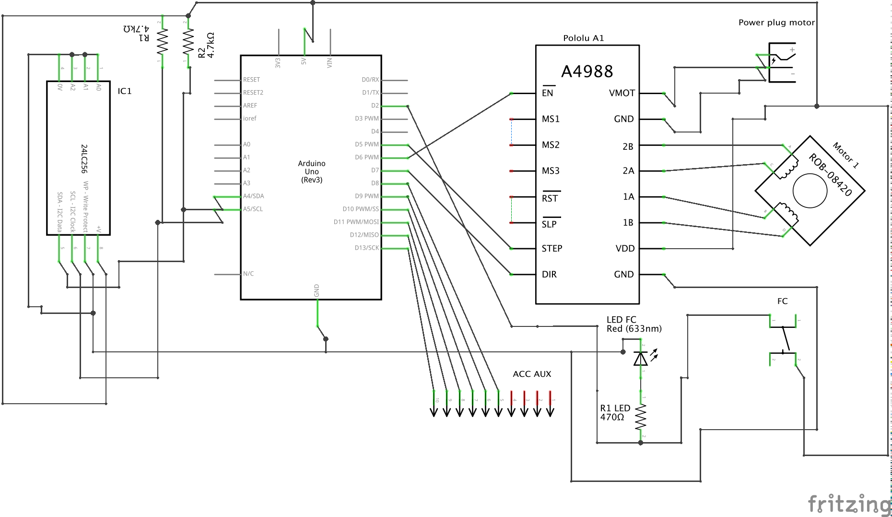
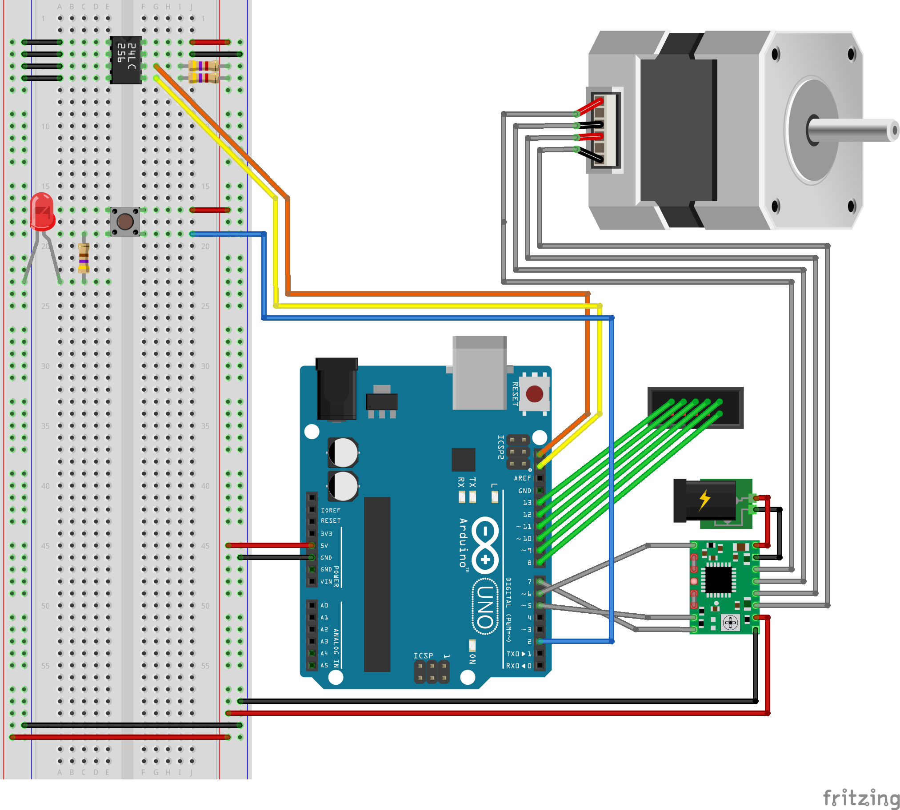

# ATmega328 24LC256

Axis control with microcontroller and learned position memory.

This code was done as part of the Microcontrollers and Power Electronics course at UNCuyo (Universidad Nacional de Cuyo, Argentina). A final report, in Spanish, is available in the 'doc' folder.

## Blocks Diagram

## Flow Diagram

## Serial Port Commands

## Schematic

## License

GNU General Public License v3.0

## Author

Júlio J. da Costa Neto
